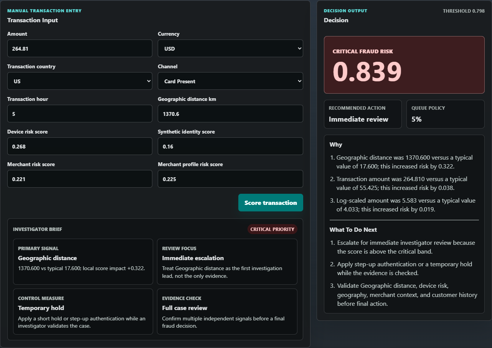
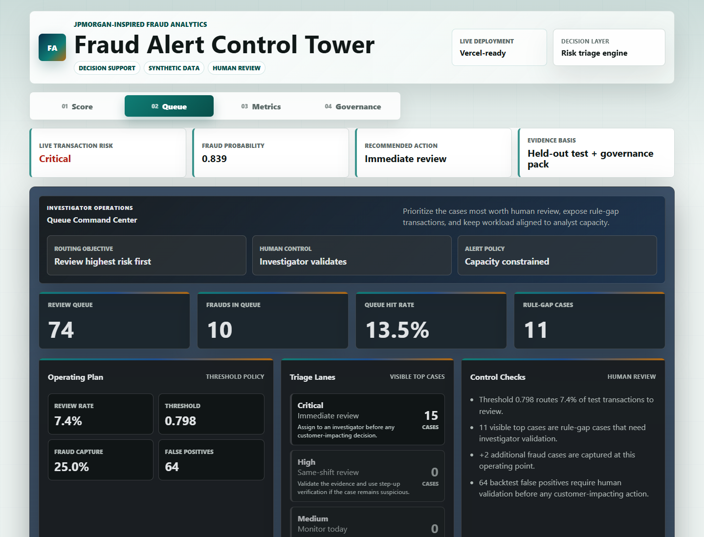
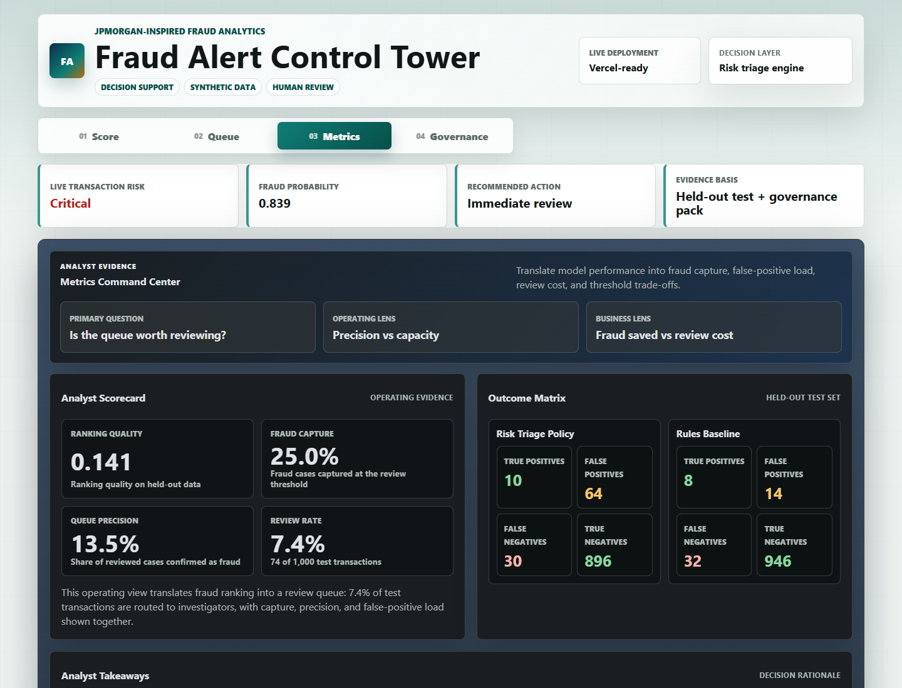
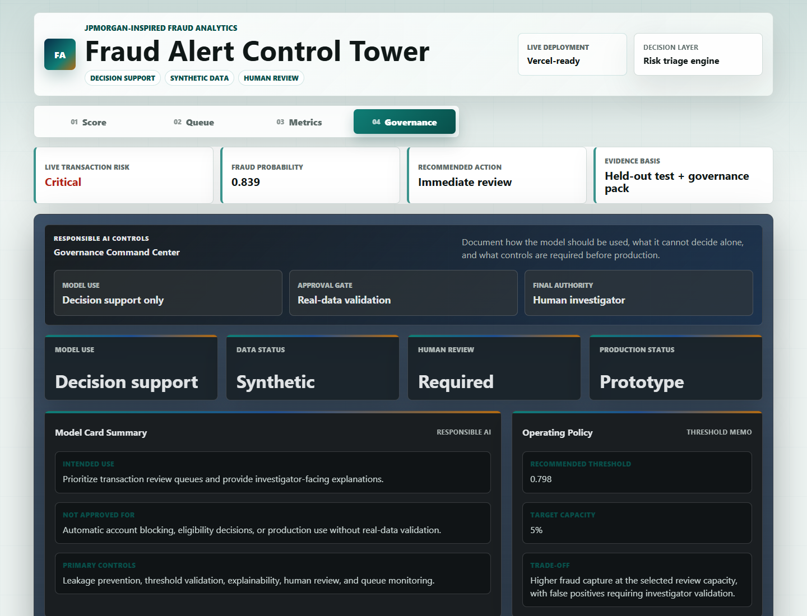

# Fraud Alert Control Tower

JPMorgan-inspired fraud analytics project that prioritizes transaction alerts, explains why a case is risky, and shows how a model threshold becomes an investigator-capacity decision.

> Portfolio note: this is a synthetic-data capstone project. It is not affiliated with JPMorgan Chase and is not production-approved.

## Links

- Live demo: [Fraud Alert Control Tower](https://fraud-alert-control-tower-5cic.vercel.app)
- Score demo: [Manual transaction scoring](https://fraud-alert-control-tower-5cic.vercel.app/?view=score)
- Queue view: [Investigator queue](https://fraud-alert-control-tower-5cic.vercel.app/?view=queue)
- Metrics view: [Operating metrics and capacity ladder](https://fraud-alert-control-tower-5cic.vercel.app/?view=metrics)
- Governance view: [Model risk controls](https://fraud-alert-control-tower-5cic.vercel.app/?view=governance)
- Executive deck: [`presentation/fraud-alert-control-tower-executive-story.pptx`](presentation/fraud-alert-control-tower-executive-story.pptx)
- Governance docs: [`docs/governance`](docs/governance)

## What This Project Demonstrates

- End-to-end fraud analytics workflow: data audit, cleaning, joins, feature engineering, feature selection, fraud-risk scoring, thresholding, explainability, and app deployment.
- Responsible AI framing: leakage prevention, model-card documentation, human review, threshold governance, risk register, approval gates, and monitoring controls.
- Recruiter-friendly product thinking: the final app is not just a classifier; it is an investigator control tower with explanations, risk/protective feature impact, an investigator brief, queue command controls, governance evidence, and recommended next actions.
- Investigator workflow depth: transaction ID lookup, case drilldown, queue filters, exportable case reports, and a live threshold/capacity simulator.

## Live-Style App Screenshots

### Fraud Decision And Explanation



### Investigator Queue



### Operating Metrics



### Governance View



## Business Problem

Fraud investigation teams usually cannot review every transaction. A useful model must do more than predict fraud probability. It must help decide which cases enter the queue, how much review capacity is required, and why each case deserves human attention.

This project treats fraud alerting as an operating-control problem:

1. Score transaction risk.
2. Rank cases for investigator review.
3. Set thresholds based on capacity.
4. Explain high-risk drivers.
5. Generate an investigator brief and practical review measures.
6. Show queue operating controls, triage lanes, and legacy-alert gaps.
7. Document governance limits before production use.

## Dataset Summary

- Transactions profiled: `5,000`
- Raw fraud rate: `4.02%`
- Data sources: transactions, customers, merchants
- Known data issue handled: broken `tenure_months` values
- Missing customer joins preserved with `customer_profile_missing_flag`
- Leakage avoided by excluding `alert_generated`, IDs, and target fields from modeling

## Cleaning And Feature Engineering

The Python pipeline:

- Parses transaction timestamps.
- Normalizes country labels, including `GB` to `UK`.
- Left joins customer and merchant profiles at transaction grain.
- Adds missing-profile flags instead of dropping records.
- Flags broken tenure values rather than treating them as valid numeric tenure.
- Builds time features such as transaction hour, day of week, month, and weekend flag.
- Creates `amount_log1p` to reduce skew from transaction amount.
- Creates cross-border behavior signals.
- Removes leakage fields before feature selection and model training.

## Top 10 Selected Features

Selected using training-only mutual information:

| Rank | Feature |
|---:|---|
| 1 | `geo_distance_km` |
| 2 | `txn_country` |
| 3 | `synthetic_identity_score` |
| 4 | `merchant_risk_score` |
| 5 | `channel` |
| 6 | `txn_hour` |
| 7 | `device_risk_score` |
| 8 | `merchant_profile_risk_score` |
| 9 | `transaction_amount_usd` |
| 10 | `amount_log1p` |

## Operating Evidence

The final risk triage layer uses the same top-10 feature set so the app remains explainable. The app's Metrics tab focuses on operating evidence rather than a model leaderboard: ranking quality, fraud capture, queue precision, review workload, false positives, missed fraud, and threshold trade-offs.

At the selected review threshold:

- Ranking quality score: `0.141`
- Fraud capture: `25.0%`
- Queue precision: `13.5%`
- Review count: `74`
- False positives: `64`

Metrics interpretation: ranking quality is tracked because the fraud class is rare, but it is not treated as the only decision point. Queue precision, review count, false positives, and fraud capture are shown together so the score is evaluated as an operating decision rather than a single technical metric.

## Threshold Strategy

Recommended review threshold: `0.7977`

At this threshold on the held-out test set:

- Review count: `74`
- Queue rate: `7.4%`
- Hit rate: `13.5%`
- Fraud capture: `25.0%`
- True positives: `10`
- False positives: `64`
- False negatives: `30`

Exact top-5% queue:

- Review count: `50`
- Hit rate: `18.0%`
- Fraud capture: `22.5%`

Business interpretation: the threshold is not just a modeling parameter. It is a staffing and operating-control decision.

## Business Impact And Alert Economics

The selected threshold is also a financial trade-off. On the same held-out test split, the operating policy changes the review queue as follows:

| Item | Existing alert | Risk triage policy | Change |
|---|---:|---:|---:|
| Reviewed cases | 22 | 74 | +52 |
| Fraud cases caught | 8 | 10 | +2 |
| False positives | 14 | 64 | +50 |

Illustrative sensitivity assumptions:

- Review cost per case: `$8`
- Avoided loss per captured fraud: `$500`
- Additional review spend: `$416`
- Additional avoided fraud loss: `$1,000`
- Illustrative net impact: `$584`

This is not a production ROI claim. It shows how a fraud analytics team can connect model thresholds to investigation cost, fraud capture, and business value.

## Explainability

The app explains each transaction with local sensitivity analysis against a reference profile.

Example high-risk output:

- Risk probability: updates from the live form
- Prediction: low, medium, high, or critical fraud risk
- Priority: shown as the recommended investigator action
- Main reason: geographic distance was far above the typical reference value
- Secondary reason: P2P channel increased model risk

Global feature importance showed `geo_distance_km` as the strongest risk driver in the final model behavior.

## Governance Position

This project is framed as decision support only:

- Human review is required before action.
- Synthetic data limits production validity.
- Thresholds must be recalibrated as fraud patterns and staffing capacity change.
- Explanations describe model behavior, not guaranteed causality.
- Production use would require real-data validation, monitoring, audit logging, bias/proxy review, and model-risk approval.

## App

The app is a Vercel-style static browser application. It does not need Streamlit or a Python server at runtime.

Views:

- `Score`: user enters transaction details and receives a prediction, probability, priority tier, and explanation.
- Transaction lookup: users can search exported top-risk transaction IDs, auto-fill available case facts, compare the exported score to the current form score, and export an investigator report.
- Manual transaction input: users enter transaction facts and the app calculates the Low, Medium, High, or Critical alert tier from the score.
- `Queue`: highest-risk cases are ranked for investigator review, with filters for priority, backtest outcome, legacy-rule status, and transaction ID.
- `Metrics`: operating evidence, feature importance, threshold/capacity simulator, pilot recommendation, and alert economics.
- `Governance`: model-card summary, threshold policy, and monitoring controls.

Run locally:

```powershell
python -m http.server 4173
```

Then open:

```text
http://localhost:4173
```

Deploy to Vercel:

```text
Use the repository root as the Vercel project root.
```

If you already created a Vercel project with `app` as the root, that also works. The static app files are available in both places so Vercel can serve `index.html` reliably.

## Key Artifacts

- Modeling pipeline: `src/fraud_pipeline.py`, `src/train_model.py`
- Risk scoring and threshold evaluation: `src/model_selection.py`, `src/compare_models.py`
- Explainability: `src/explainability.py`, `src/explain_model.py`
- Web model export: `src/export_model_for_web.py`
- Static app: `app`
- Root static deployment files: `index.html`, `styles.css`, `app.js`, `model.json`, `dashboard-data.json`
- Screenshots: `assets`
- Modeling outputs: `artifacts/modeling`
- Governance pack: `docs/governance`
- Deployment checklists: `docs/deployment`
- Executive deck: `presentation/fraud-alert-control-tower-executive-story.pptx`

## Repository Structure

```text
fraud-alert-control-tower/
  README.md
  requirements.txt
  src/
  app/
  assets/
  artifacts/modeling/
  docs/governance/
  docs/deployment/
  docs/reports/
  presentation/
```

## Data Note

The clean GitHub package does not include raw source data by default. The repository includes model outputs, app assets, governance documentation, and the static app. If raw synthetic data is allowed to be public, add a `data/` folder later and update this section with provenance notes.

## Interview Pitch

I built an explainable fraud alert prioritization system that treats fraud detection as an operational control problem. The project cleans and joins transaction, customer, and merchant data, selects the top 10 risk features using training-only mutual information, builds a fraud-risk triage layer, and tunes the decision threshold around investigator capacity. I then export the scoring layer into a static Vercel-style app and document governance through a model card, threshold memo, and responsible-AI summary.

The strongest part of the project is that it does not stop at prediction. It shows how a bank would decide which cases get reviewed, why they are risky, and what controls would be needed before production use.
